<!-- 🕷️ SPIDER-MAN GITHUB PROFILE GENERATOR -->
<!-- Animated README — all motion is SMIL/CSS-in-SVG so it renders everywhere -->

<p align="center">
  
</p>

<p align="center">
  
  
  
  
</p>

<p align="center">
  <sub>Turn your GitHub profile into an animated, Spider-Verse comic-book README — with <b>zero backend</b> and <b>two ways</b> to keep the stats fresh.</sub>
</p>

---

<!-- ════════════════════════════════════════════════════════════════════════
     ANIMATED HERO — the same SVG your profile README gets
     ════════════════════════════════════════════════════════════════════════ -->

<p align="center">
  
</p>

<!-- ════════════════════════════════════════════════════════════════════════
     LIVE DEMO — real stats rendered by YOUR worker (if deployed)
     ════════════════════════════════════════════════════════════════════════ -->

## 🕸️ See it live — real stats, real-time

<sub>These badges pull live data from your GitHub profile via the Cloudflare Worker. No stale screenshots — the numbers you see are right now.</p>

<p align="center">
  
</p>

<p align="center">
  
</p>

<p align="center">
  
</p>

<p align="center">
  
</p>

<p align="center">
  
</p>

---

<!-- ════════════════════════════════════════════════════════════════════════
     HOW IT WORKS — visual pipeline
     ════════════════════════════════════════════════════════════════════════ -->

## 🕷️ How it works

```
┌─────────────────────────────────────────────────────────────────────────────┐
│                                                                             │
│   ┌──────────────┐     ┌──────────────┐     ┌──────────────────────────┐   │
│   │  YOUR DATA   │────▶│  GENERATOR   │────▶│  ANIMATED PROFILE README │   │
│   │              │     │              │     │                          │   │
│   │ • Username   │     │ • React + TS │     │ • 9 animated SVGs        │   │
│   │ • PAT (opt)  │     │ • Client-side│     │ • SMIL animations        │   │
│   │ • Projects   │     │ • No backend │     │ • Real brand icons       │   │
│   │ • Socials    │     │ • In-browser │     │ • Categorized arsenal    │   │
│   └──────────────┘     └──────────────┘     └──────────────────────────┘   │
│                                                                             │
│                          ┌──────────────────────┐                           │
│                          │   TWO WAYS TO STAY   │                           │
│                          │       FRESH          │                           │
│                          ├──────────────────────┤                           │
│                          │                      │                           │
│                          │  ① GitHub Action     │                           │
│                          │     Mon & Thu 06:17  │                           │
│                          │     commits fresh SVGs│                           │
│                          │                      │                           │
│                          │  ② Cloudflare Worker │                           │
│                          │     Live badge URLs  │                           │
│                          │     Cache: 5 minutes │                           │
│                          │     Always current   │                           │
│                          │                      │                           │
│                          └──────────────────────┘                           │
│                                                                             │
└─────────────────────────────────────────────────────────────────────────────┘
```

---

<!-- ════════════════════════════════════════════════════════════════════════
     FEATURES — animated cards with icons
     ════════════════════════════════════════════════════════════════════════ -->

## ⚡ Features

<table>
  <tr>
    <td width="50%" valign="top">
      <h3>🎬 9 Animated SVGs</h3>
      <p>Hero, spider-sense, hero stats, web streak, web arsenal, 52-week swing, achievements, divider, footer. All motion is <b>SMIL/CSS-in-SVG</b> — no <code>&lt;script&gt;</code>, so animations render inside GitHub README images.</p>
    </td>
    <td width="50%" valign="top">
      <h3>🔥 Live GitHub Stats</h3>
      <p>Commits, PRs, streak, contributions calendar, language share. Fetched client-side from the GitHub REST + GraphQL APIs. Paste an optional read-only PAT to unlock pinned repositories and your real contribution graph.</p>
    </td>
  </tr>
  <tr>
    <td width="50%" valign="top">
      <h3>🕸️ Self-Categorizing Arsenal</h3>
      <p>Real language bytes auto-sort into <i>Programming Languages / AI·ML·DATA / Backend / Frontend / Databases / Tools & DevOps</i>, plus a curated picker for the tools GitHub can't see (Postman, Power BI, VS Code…).</p>
    </td>
    <td width="50%" valign="top">
      <h3>☁️ Two Ways to Stay Fresh</h3>
      <p>Commit the assets and let the bundled GitHub Action re-render them twice a week, <b>or</b> flip the generator to <i>Live badges</i> and serve them from a Cloudflare Worker with a server-side token — always current, no Action needed.</p>
    </td>
  </tr>
</table>

---

<!-- ════════════════════════════════════════════════════════════════════════
     QUICKSTART — visual steps
     ════════════════════════════════════════════════════════════════════════ -->

## 🚀 Quickstart

### Option A: Hosted Generator (recommended)

```bash
cd app
npm install
npm run dev
# → http://localhost:5173
```

1. **Enter your GitHub username** → Hit **Load data**
2. **(Optional)** paste a read-only PAT to unlock pinned repos + your real contribution graph
3. **Tune** Missions, Socials, and Web Arsenal panels
4. **Download** → unzip into a new `username/username` repo → commit → push → done

### Option B: CLI (offline / no browser)

```bash
python tools/generate.py --username yourname --token ghp_xxx
```

### Option C: Auto-setup (no app, username detected for you)

The bundled GitHub Action reads `github.repository_owner` at runtime — in a `username/username` repo that is *always* your username. No hardcoded values.

1. **Create the repo**: a new **public** repo named exactly `yourusername/yourusername`
2. **Drop in the theme**: clone the zip's contents into the repo root
3. **Enable Actions**: run the workflow once from the *Actions* tab

---

<!-- ════════════════════════════════════════════════════════════════════════
     LIVE BADGES — Cloudflare Worker setup
     ════════════════════════════════════════════════════════════════════════ -->

## ☁️ Live badges — always-fresh stats from a Cloudflare Worker

<p align="center">
  
  
  
</p>

```bash
cd workers
npm install
npx wrangler login
npx wrangler deploy                    # writes the .workers.dev URL
npx wrangler secret put GITHUB_TOKEN   # paste a read-only PAT — lives only in Cloudflare
```

**Point the generator at it:** in the *Web Arsenal* panel, switch *Stats delivery* to **Live badges** and paste your `https://spidey-stats.….workers.dev` URL. The generator rewrites the README's data-SVG references to badge URLs.

```text
https://spidey-stats.<your-subdomain>.workers.dev/{username}/streak.svg
https://spidey-stats.<your-subdomain>.workers.dev/{username}/hero-stats.svg
https://spidey-stats.<your-subdomain>.workers.dev/{username}/achievements.svg
https://spidey-stats.<your-subdomain>.workers.dev/{username}/arsenal.svg?tools=fastapi,react,...
https://spidey-stats.<your-subdomain>.workers.dev/{username}/swing.svg
```

---

<!-- ════════════════════════════════════════════════════════════════════════
     CONTRIBUTION GRAPH — live from GitHub
     ════════════════════════════════════════════════════════════════════════ -->

## 📊 Contribution Activity

<p align="center">
  <a href="https://github.com/Robibiruk">
    
  </a>
</p>

---

<!-- ════════════════════════════════════════════════════════════════════════
     TECH STACK — visual badges
     ════════════════════════════════════════════════════════════════════════ -->

## 🛠️ Tech Stack

<p align="center">
  
  
  
  
  
  
  
  
  
  
</p>

---

<!-- ════════════════════════════════════════════════════════════════════════
     PROJECT STRUCTURE — visual tree
     ════════════════════════════════════════════════════════════════════════ -->

## 🗂️ Project Structure

```
spiderman-github-readme/
├── app/                     # Vercel-ready React generator (Vite + TypeScript)
│   ├── src/
│   │   ├── lib/
│   │   │   ├── github.ts    # REST + GraphQL data layer (optional PAT)
│   │   │   ├── arsenal.ts   # Auto-categorization + curated tool picker
│   │   │   ├── render.ts    # 9 animated SVG builders
│   │   │   ├── icons.ts     # 144 vendored simple-icons + monogram glyphs
│   │   │   ├── download.ts  # JSZip assembly of the profile .zip
│   │   │   └── ...
│   │   └── components/
│   └── public/              # Payload files shipped inside the .zip
├── workers/                 # Cloudflare Worker (live badge mode)
│   └── src/index.ts         # GET /{username}/{asset}.svg, server-side token
├── tools/                   # Offline Python CLI (also ships in the .zip)
│   ├── generate.py          # The same renderers, in Python
│   └── tech_icons.py        # simple-icons path data
├── assets/                  # Pre-generated demo assets
│   ├── hero.svg             # Animated hero with radar + city lights
│   ├── hero-stats.svg       # Headline stats + letter-grade rating
│   ├── streak-stats.svg     # Streak pulse + totals
│   ├── achievements.svg     # Rank-card achievements + XP bar
│   ├── web-arsenal.svg      # Categorized toolbox with real brand icons
│   ├── web-swing.svg        # 52-week activity skyline
│   ├── spider-sense.svg     # Radar ping status
│   ├── web-divider.svg      # Animated web divider
│   └── footer.svg           # Animated footer
├── theme/
│   └── theme.json           # Palette tokens, typography, terminology
├── templates/
│   ├── README.md.tmpl       # README template with {{PLACEHOLDERS}}
│   └── hero.svg.tmpl        # Hero SVG template
└── workflow/
    └── refresh.yml          # GitHub Action: Mon + Thu 06:17 UTC
```

---

<!-- ════════════════════════════════════════════════════════════════════════
     THEME TOKENS — visual palette
     ════════════════════════════════════════════════════════════════════════ -->

## 🎨 Theme: Spider-Verse

<p align="center">
  
  
  
  
  
  
  
  
</p>

---

<!-- ════════════════════════════════════════════════════════════════════════
     TERMINOLOGY — fun mapping
     ════════════════════════════════════════════════════════════════════════ -->

## 🕷️ Spider-Verse Terminology

| GitHub Default | Spider-Verse |
|---------------|--------------|
| Profile | Hero Identity |
| Stats Section | Hero Stats |
| Commits | Web Shots |
| Repositories | Missions |
| Pull Requests | Team-Ups |
| Issues Closed | Villains Defeated |
| Contribution Streak | Web Streak |
| Stars | Citizens Saved |
| Followers | Spider-Sense Network |
| Languages | Web Arsenal |
| Most Active Repo | Current Mission |
| Total Contributions | Hero XP |
| Account Age | Years in the City |

---

<!-- ════════════════════════════════════════════════════════════════════════
     STATS — live GitHub stats
     ════════════════════════════════════════════════════════════════════════ -->

## 📈 Project Stats

<p align="center">
  
  
  
  
  
</p>

---

<!-- ════════════════════════════════════════════════════════════════════════
     FOOTER — animated
     ════════════════════════════════════════════════════════════════════════ -->

<p align="center">
  
</p>

<p align="center">
  <sub>Generated with the <b>Spider-Man GitHub Profile Generator</b> — your friendly neighborhood README builder.</sub>
</p>

<p align="center">
  
</p>

<p align="center">
  <sub>🕷️ <i>"With great code comes great responsibility."</i></sub>
</p>
